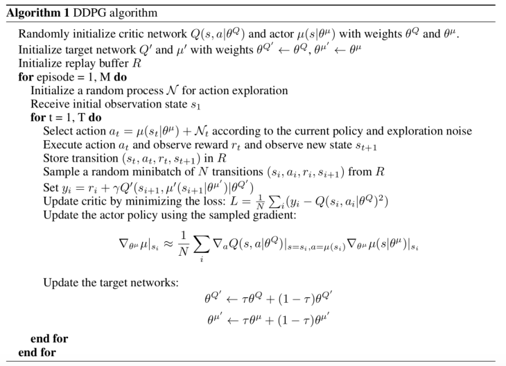
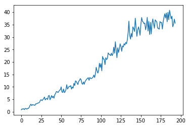

### Learning Algorithm
I use DDPG learning algorithm. Main key points of DDPG are as follows
* Replay Buffer
* soft target update
* Batch Normalization
* add noise for explore
#### DDPG Pseudo Code

### Models

#### Actor
* bn1 : nn.BatchNorm1d(state_size)
* fc1 : nn.Linear(state_size, fc_units)
* activation : nn.functional.relu
* bn2 : nn.BatchNorm1d(fc_units)
* fc2 : nn.Linear(fc_units, fc2_units)
* activation : nn.functional.relu
* bn3 : nn.BatchNorm1d(fc2_units)
* fc3 : nn.Linear(fc2_units, action_size)
* activation : torch.tanh
#### Critic
* bn1 : nn.BatchNorm1d(state_size)
* fcs1 : nn.Linear(state_size, fcs1_units)
* activation : nn.functional.leaky_relu
* fc2 : nn.Linear(fcs1_units+action_size, fc2_units)
* activation : nn.functional.leaky_relu
* fc3 : nn.Linear(fc2_units, 1)
#### Hyper parameters
Parameter | Value
--- | ---
BUFFER_SIZE | int(1e6)
BATCH_SIZE | 512
GAMMA | 0.99  
TAU | 1e-3
LR_ACTOR | 1e-3
LR_CRITIC | 1e-3
WEIGHT_DECAY | 0
LEARNING_REPEAT | 20
LEARNING_STEP | 20

I train my algorithm by changing hyper parameters.

'128,256,512' BATCH_SIZE, '5,10,20' LEARNING_REPEAT,

'1e-5,1e-4,1e-3' LR_ACTOR,LR_CRITIC

### Plot of Rewards

### Future Work

* apply another algorithms(PPO, A3C)
* find optimal network model
* apply DDPG to pixel input environment